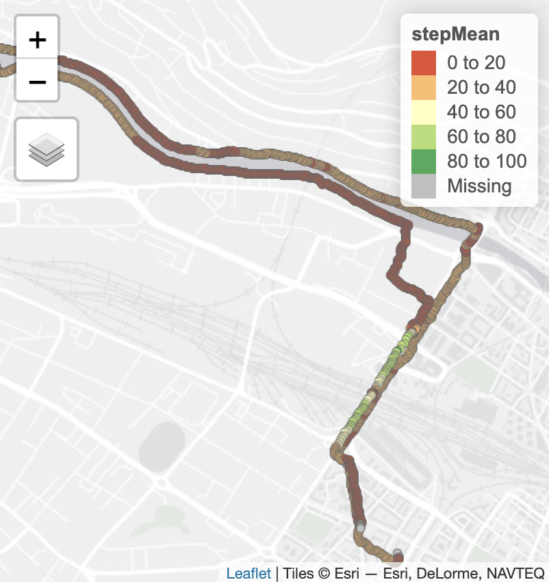

# Semester Project Proposal

```{=html}
<!-- 
Please render a pdf version of this Markdown document with the command below (in your bash terminal) and push this file to Github

quarto render Readme.md --to pdf
-->
```
Patterns & Trends in Environmental Data  2024

| Semester:      | FS24                                                                                           |
|:-----------------|:-----------------------------------------------------|
| **Data:**      | Movement Data (April - June 2024) gathered with Strava by two individuals                                                                      |
| **Title:**     | Movement type detection - the potential of cluster and similarity analysis in selected movement data |
| **Student 1:** | Laura Vetter                                                                                   |
| **Student 2:** | Lucia Scheele                                                                                  |

### Abstract

In order to understand travel behaviour, it is critical to analyze movement data and be able to classify different types of movement correctly (Sadeghian et al. 2020). In this semester project, movement data collected by two individuals over a three month period is analyzed and compared in order to understand the concepts of segmentation, similarity analysis and k-means clustering and test whether these methods can be applied to human movement data with relatively small coherence within the data sets. 


## 1 Research Questions

<ol>

<li>Which movement types can be detected in a collection of
trajectories specifically (a) within one trajectory and (b) between
different trajectories using segmentation and clustering?</li>

<li>What patterns can be detected in the resulting bike riding data of two
individuals? Is it possible to detect which trajectory was done by which
person?</li>

<li>How can movement data with similar spatial but varying time
parameters, namely running data from the same person on the same track,  be analyzed with the common similarity measures (DTW, FD,
EDR, LCSS)?</li>

<ol>

## 2 Data

<!-- What data will you use? Will you require additional context data? Where do you get this data from? Do you already have all the data? -->

The data sample consists of movement data collected with the Tracking
App Strava, by two individuals over a timespan of April - May 2024.
Overall, 31 trips were recorded (17 Trips + 14 Trips per individual)
with the movement types walking, running, cycling, bus, tram, train and
car. Data points were recorded every second, resulting in a relatively high resolution of data. However, data frequency is not consistent in all cases due to lack of signal (e.g. in a train). .

Additional data that might be used for the analysis include metadata
from Strava, our individual knowledge about trips and traffic
infrastructure data by the city of Zurich (
[https://www.stadt-zuerich.ch/geodaten/](#0){.uri} ). While movement type information is given with Strava metadata, this data is not accurate in all cases. For example, a tracks might be recorded as a travel by train but include the walk or bike ride to the train station. In these cases, it is interesting to perfom a segmentation analysis and supply this analysis with personal knowledge of the trips.  

## 3 Analytical concepts

### Conceptual movement spaces and modelling approaches</u>

In Strava, a point with location and timestamp is created by default
every second (if the signal allows for it), it is therefore a discrete
dataset with a relatively high resolution. The scale at which the
spatial data is analyzed is important, as derived movement parameters
(e.g. speed, step length or turning angle) are strongly influenced by it
(Laube & Purves 2011). This must be considered when conducting
analysis for the different movement types.

### Segmentation

Since some trajectories include several movement types, we will apply
two types of trajectory segmentation:  

In the first step, segmentations will be conducted by considering the
static points (i.e. using the stepMean & static functions developed in class). This seperates segments with a moving pause in between, which might be the case when changing the transport mode (e.g. from walking to bus). In case different movement types cannot be seperated by static
points (i.e. changing from walking to running), segmentations will be
achieved with the different characteristics of the respective movement
in a second step.
For example, the parameters for the walking segments could be: 

-   Treshhold: longer than 60 seconds 

-   average speed not faster than 6 km/h 

-   maximum speed should not be greater than 12 km/h (otherwise
    running) 

In result, some data is directly classified into one class, whereas some
can be "multiclassfied", meaning it could belong to e.g. running or
walking. Some segments might also be wrongly classified (e.g. train
stops, when the subject stays in the train).  Again, if time and resources allow for it, these multi-class segments are compared with transport infrastructure data. If the negative acceleration (stopping) of a segment happens in the defined range of a train station, it could thereby still be classified as a movement by train. Meanwhile, it needs to be considered to not to classify running segments as an incoming train.

### Cluster analysis

Concerning the cluster analysis, space and time of trajectories will be
treated to be relative. For the similarity analysis of a repeated
running track, the spatial data is similar and will thus be treated as
absolute.  
The parameters to cluster and to assess similarity of the trajectories
will be the following: 
-   Average, maximum and minimum speed 

-   average acceleration and acceleration during each segment 

-   segment distance 

-   Possibly: direction, duration, azimuth and sinuosity 

If time and resources allow it, the unsupervised learning algorithm k-means, the most common in non-hierarchical clustering methods (Bachir et al., 2018), will be applied to cluster segments
within and between trajectories. The quality of this analysis will then
be assessed by comparing the results with the STRAVA metadata and the knowledge of the subjects about their movement type.  \
By reducing the number of k, Sadeghian et. Al. (2020) could improve the
performance of the k-means method. Therefore, this analysis will explore
different k-values (i.e. 7,5,4) and, if necessary, reduce the number of
distinct movement types. 

### Similarity 

Concerning a homogenous subset of data where the same route was used
several times, different trajectories will be compared using
four distinct similarity measures (DTW, EditDist, Frechet, LCSS). The
objective is to evaluate how well each similarity measure predicts the
speed and spatial differences of the trajectories. 

## 4 R concepts

<!-- Which R concepts, functions, packages will you mainly use. What additional spatial analysis methods will you be using? -->

| Step in the analysis    | Package used             |
|:------------------------|:-------------------------|
| **Preprocessing**       | readr, dplyr, lubridate, |
| **Segmentation**        | dplyr, lubridate         |
| **Clustering**          | MKMeans {MKMeans}?       |
| **Similarity analysis** | similaritymeasures       |
| **Visulization**        | ggplot, tmap, plotly     |

## 5 Expected Results / products

### Movement types

Respective of the different activities that we tracked with Strava, we
expect to find 7 movement types (i.e. walking, running, cycling, bus,
tram, train and car).

### Bike Trajectories

When applying the clustering method to our bike trajectories the results
could be affected by several factors. We are curious to see if there
were enough differences in our biking behavior to result in clusters
that each match one person. We are though aware, that for example, a
parameter like biking speed will be correlated to the respective
environment (urban vs. rural, settlement vs. lake-side). If we use this
parameter for the clustering, the results may thus also represent
differences of the respective environment.

### Running Trajectories 

Concerning the running trajectories, we have three expectations:

-   Running trajectories from the same route but at different times are
    expected to be relatively similar, and less similar when there are
    spatial dissimilarities.

-   Cycling trajectories from different routes by one person are
    expected to be dissimilar (because of spatial variation).

-   Cycling speed and acceleration patterns between individuals are
    expected to be dissimilar because of spatial variation and different
    acceleration and speed behaviour.

## 6 Risk analysis

<!-- What could be the biggest challenges/problems you might face? What is your plan B? -->

The following challenges could affect the analysis of the collected data:  

-   outliers, e.g. resulting from missing data because of GPS signal
    interruptions in tunnels  

-   variability of the data due to different transport modes during one
    trajectory makes segmentation cumbersome 

-   recording frequency: 14 + 17 trips, is not a high sampling rate.  

-   similarity/clustering may take a long time to compute  

Also, there are different risks of computing methods: 

-   Using speed thresholds for segmentation of trajectories by movement
    type, leads to misclassification if a fast movement type like train
    happens to travel slower. Thus, a trajectory of one movement type is
    split into several segments.  

-   Calculation of speed (distance/time) parameters over a larger scale
    leads to parameter underestimation in sinuous trajectories 

## 7 Questions?

<!-- Which questions would you like to discuss at the coaching session? -->

-   How do we deal with inconsistencies of recording frequency (e.g. due to lack of signal, causing a timelag that differs from the default of 1s? 

-   Does it make sense to use similarity measures for data that is
obviously not similar? 
-   What papers do best explain the use of k-means in R for our purposes?
-   If we want to analyze the cycling behavior of the two individuals at
crossroads (e.g.: if they slow down or just pass without looking?), how
would we define crossroads (=turning points)? Ideas: by sinuosity (if
more than 45°), by intersection or streets? \
-   Can/should we use a smoothing algorithms (like Moving Window) for the segmentation? How does this change our data? 

## Bibliography

*Bachir, D., Khodabandelou, G., Gauthier, V., El Yacoubi, M., Vachon, E., (2018). Combining Bayesian inference and clustering for transport mode detection from sparse and noisy geolocation data. Joint European Conference on Machine Learning and Knowledge Discovery in Databases 569–584.*

*Laube, P., & Purves, R. S. (2011). How fast is a cow? Cross‐scale analysis of movement data. Transactions in GIS, 15(3), 401-418.*

*Sadeghian, P., Zhao, X., Golshan, A., & Håkansson, J. (2022). A stepwise methodology for transport mode detection in GPS tracking data. Travel Behaviour and Society, 26, 159-167.*


##  Annex

{width="40%"}


